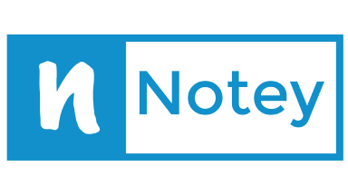

# Minimum Viable Product
Persistent Markdown Notitie App

- Show all notes list with new notes button
    - Click on new notes button > Show Title field, Content field, Submit button
        - Submit > sends data to database through API > Returns to overview
    - Click on note
        Show Title and Content on new page in plain markdown

# General Structure
Notebook   (sharable?)
- contains Notes
    - Markdown op de achtergrond, uiteindelijke mooiere frontend
    - Inline Notes shorthand

(DND) Templates
- Notebook = DND related
    - DnD related adds templates like "location, npc, player" which populates the content field

# Database

## Notes
ID auto increment (UUID) | Title | Content | Owner | Creation Date | Last Edited

## Tags
Note ID | Tag Name

## Users
ID | Username | Password | Email | Refresh Token

## Share
Note ID | User ID | Rights (edit, read)

# Backend Flow
MD frontend > backend > Database

Database > Backend > HTML Parse > XSS Parse > Frontend